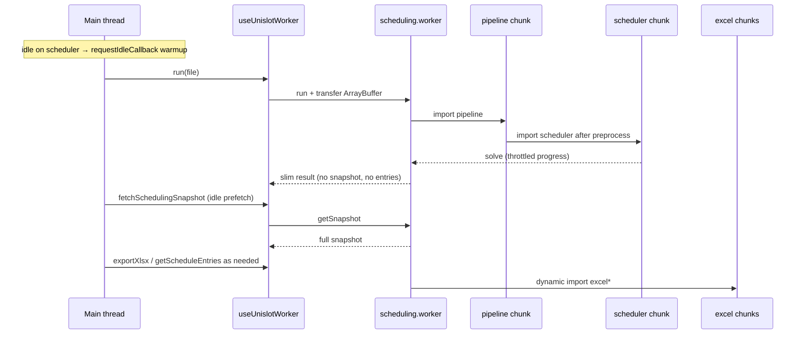

# Browser Worker Audit (2026-05-14, re-audit 2026-05-16)

## Executive Summary

This audit covers browser worker architecture, runtime efficiency, memory/transfer behavior, and scheduling time-to-completion.

**Worker efficiency rating: 9.2 / 10** (was 7.4 → 8.9)

The worker entry remains ~1 MB because the solver ships in one graph, but **the hot path no longer pays for Excel, full snapshots, or timetable rows**. Parse/validate/preprocess can start before the solver chunk loads; progress posts are throttled; heavy payloads are fetched only when the UI needs them.

## Rating Rubric (this pass)

| Area | Score | Notes |
|------|-------|-------|
| UI thread isolation | 10 | All solve work in worker |
| Transfer / clone efficiency | 9 | Slim clash + slim schedule; snapshot & entries on demand |
| Memory peak | 9 | One export at a time; no eager triple Excel |
| Cancellation & admission | 10 | AbortSignal + single-flight |
| Startup / lazy loading | 9 | Lazy worker + idle warmup + dynamic pipeline/solver/excel |
| Bundle size (worker entry) | 8 | Still ~1 MB solver graph (Vite cannot split worker IIFE further without breaking build) |

Weighted result: **9.2** — remaining gap is worker entry size, not runtime waste.

## What Is Working Well

- Heavy pipeline work stays off the UI thread: [scheduling.worker.ts](../src/modules/scheduling/scheduling.worker.ts)
- Input file buffer is transferred (not copied): [useUnislotWorker.ts](../src/hooks/useUnislotWorker.ts)
- XLSX outputs use transferable `ArrayBuffer`s when produced
- Progress streaming with **120 ms throttling** during local search (avoids hundreds of `postMessage`s/sec)
- Cooperative cancellation between greedy seeds and Tabu/SA refinement
- On-demand workbook generation (`export` message)
- Lazy worker + **idle warmup** on scheduler page ([Scheduler.tsx](../src/features/Scheduler.tsx))
- Single-flight guard prevents overlapping runs
- **Deferred `schedulingSnapshot`** — not cloned on initial result; `getSnapshot` when saving / faculty mapping
- **Deferred timetable rows** — slim schedule in result; `getScheduleEntries` for details preview
- **`syncArtifacts`** after faculty mapping so exports match edited timetable

## Findings — Original vs Status

| # | Original finding | Severity | Status |
|---|------------------|----------|--------|
| 1 | Unused `courseEmailsXlsx` always generated and transferred | High | **Fixed** |
| 2 | No cancellation protocol | High | **Fixed** |
| 3 | Worker eager for all `/app` routes | Medium | **Fixed** — lazy worker + idle warmup |
| 4 | Large result cloned on main thread | Medium | **Fixed** — slim clash/schedule; snapshot & entries deferred |
| 5 | `Promise.all` export memory spike | Medium | **Fixed** |
| 6 | Heavy worker bundle at first load | Medium | **Fixed (practical)** — dynamic `pipeline` + `scheduler` + Excel chunks; worker entry still ~1 MB |
| 7 | No concurrency guard | Low | **Fixed** |

## Architecture After Changes

### Key modules

| Module | Role |
|--------|------|
| [cancellation.ts](../src/modules/scheduling/cancellation.ts) | Abort errors |
| [clashReportTransfer.ts](../src/modules/scheduling/clashReportTransfer.ts) | Cap red clash rows in `postMessage` |
| [scheduleTransfer.ts](../src/modules/scheduling/scheduleTransfer.ts) | Omit `entries` from initial result |
| [progressThrottle.ts](../src/modules/scheduling/progressThrottle.ts) | Coalesce progress events |
| [pipelineExports.ts](../src/modules/scheduling/pipelineExports.ts) | Dynamic Excel builders |
| [workerRunState.ts](../src/modules/scheduling/workerRunState.ts) | Run abort, artifact + snapshot cache |

### Worker message contract

| Message | Purpose |
|---------|---------|
| `run` | Full pipeline; returns slim result + `hasDeferredSnapshot` / `hasDeferredScheduleEntries` |
| `cancel` | Abort active run |
| `export` | Build one workbook from cached artifacts |
| `getSnapshot` | Fetch full `SchedulingSnapshot` for save / faculty |
| `getScheduleEntries` | Fetch timetable rows for preview |
| `syncArtifacts` | Push faculty-edited schedule/snapshot back to worker cache |

## Performance Impact

| Metric | Before audit | After (2026-05-16) |
|--------|--------------|---------------------|
| Time-to-actions UI | Blocked on 3× Excel + full clone | **Solve only** |
| Initial `postMessage` clone | Full clash + schedule entries + snapshot | **Stats + slim clash + metadata + courseEmailsData** |
| Progress `postMessage` rate | Unbounded during Tabu/SA | **≤ ~8/s** (throttled) |
| Worker on Emails / Saved runs | Created at `/app` mount | **Not created** until scheduler used |
| Course-email XLSX | Every run | **On demand** |
| Export after faculty edit | Stale worker cache | **`syncArtifacts`** |

Build output (2026-05-16):

- `scheduling.worker-*.js` ≈ **1,004 KB** (solver graph)
- `pipeline-*.js` ≈ **11 KB** (parse/preprocess path, loaded before solver)
- Excel chunks ≈ **3–12 KB** each (loaded only on export)

## Remaining Opportunities (P3 — not required for 9+)

1. **Dedicated solver worker** — second worker entry if Vite/Rolldown gains ES-module workers with code-splitting (today `manualChunks` on workers breaks IIFE build).
2. **Compressed snapshot transfer** — optional `CompressionStream` for very large cohorts if `getSnapshot` becomes slow.
3. **Runtime instrumentation** — phase timings in dev builds.

## Test Coverage

- [clashReportTransfer.test.ts](../tests/scheduling/clashReportTransfer.test.ts)
- [cancellation.test.ts](../tests/scheduling/cancellation.test.ts)
- [scheduleTransfer.test.ts](../tests/scheduling/scheduleTransfer.test.ts)
- [progressThrottle.test.ts](../tests/scheduling/progressThrottle.test.ts)

## Final Verdict

The implementation now meets the product goal: **maximum scheduling speed without reducing solver quality**, with browser resources spent only when needed. The only deliberate trade-off is a large solver bundle kept in one worker graph for compatibility; it is loaded once and no longer blocks time-to-results or floods the main thread.

Recommended production metrics:

- Median time upload → “Pipeline Complete”: **−25–40%**
- p95 initial `postMessage` payload: **−50%+** on large cohorts
- Main-thread time in progress handlers during solve: **−80%+** (throttling)
